# Ejercicio 1 — Procesamiento Visual e IA con OpenCV

## Autor

- Juan David Cárdenas Galvis

## Fecha de entrega

`2026-06-12`

---

## Descripción breve

Este ejercicio implementa un **pipeline de procesamiento visual** reproducible
en Python + OpenCV que, dada una imagen, ejecuta de forma secuencial las **ocho
operaciones obligatorias** del taller y guarda cada salida intermedia para
poder **comparar** el efecto de cada etapa. El hilo conductor es: *¿cómo
transforma cada operación de visión por computador una misma imagen, y cómo se
adapta la técnica al contenido de la entrada?* Las operaciones son, en orden:
(1) carga de la entrada con OpenCV, (2) conversión a escala de grises, (3) una
segunda representación de color (HSV y, como extra, LAB), (4) suavizado
(Gaussiano y mediana), (5) detección de bordes (Canny y Sobel), (6) una etapa
de **segmentación o detección** (técnica clásica + modelo preentrenado),
(7) guardado de resultados comparativos y (8) documentación de los parámetros y
decisiones técnicas.

Para demostrar la robustez del pipeline se procesan **dos imágenes muy
distintas**: la **imagen 1** es un personaje 3D estilizado (gafas de sol y
chaqueta de cuero) sobre **fondo blanco** de 1086 × 1448 px; la **imagen 2** es
la portada de *Abbey Road* (The Beatles), una **escena natural** compleja con
varias personas, calle, vehículos y vegetación. La etapa de segmentación es
**adaptativa**: un despachador decide, según la uniformidad del fondo, entre
extraer el sujeto (umbral por distancia al blanco + GrabCut) o segmentar por
**color con K-means** en el espacio LAB. La detección de objetos usa el modelo
preentrenado **Haar Cascade** frontal de rostros incluido en OpenCV, con un
tamaño mínimo relativo a la resolución para evitar falsos positivos. Todo es
Python puro (CPU) con `opencv-python` y `numpy`, sin GPU ni descargas externas.

---

## Implementaciones

### Python

La implementación es un único script ejecutable (`src/main.py`) parametrizable
por línea de comandos. La imagen principal (`data/entrada.png`) escribe sus
salidas en `resultados/`; cualquier otra imagen escribe en una subcarpeta
`resultados/<nombre>/` para no sobrescribir. Todos los parámetros están
centralizados como constantes al inicio del archivo para máxima trazabilidad.

```bash
# Imagen 1 (personaje sobre fondo blanco) -> resultados/
python src/main.py

# Imagen 2 (Abbey Road) -> resultados/imagen2/
python src/main.py data/IMAGEN2.jpg
```

Instalación del entorno (Python 3.10+):

```bash
python -m venv .venv
# Windows: .\.venv\Scripts\Activate.ps1   |  Linux/macOS: source .venv/bin/activate
pip install -r requirements.txt          # opencv-python, numpy
```

---

#### Bloque 1 — Carga de la entrada visual (`cargar_entrada`)

Se carga la imagen con `cv2.imread(..., IMREAD_UNCHANGED)`. Si trae canal alfa
(PNG con transparencia), se compone sobre un fondo blanco para trabajar siempre
en **BGR de 3 canales**; si viene en grises, se expande a 3 canales. Esto
garantiza que el resto del pipeline reciba siempre un formato homogéneo.

```python
imagen = cv2.imread(ruta, cv2.IMREAD_UNCHANGED)
if imagen.ndim == 3 and imagen.shape[2] == 4:
    bgr  = imagen[:, :, :3].astype(np.float32)
    alfa = imagen[:, :, 3:4].astype(np.float32) / 255.0
    imagen = (bgr * alfa + 255.0 * (1.0 - alfa)).astype(np.uint8)
```

#### Bloque 2 — Escala de grises (`a_grises`)

`cv2.cvtColor(BGR2GRAY)` reduce la imagen a una sola dimensión de intensidad.
Es la base de la detección de bordes y de la segmentación, ya que ambas operan
sobre gradientes/intensidad y no necesitan información de color.

#### Bloque 3 — Segunda representación de color (`a_hsv` / `a_lab`)

Se genera **HSV** (entregable `hsv_o_lab.png`) y, como representación adicional,
**LAB** (`lab.png`). HSV separa tono (H), saturación (S) y brillo (V), lo que
permite razonar sobre la iluminación independientemente del color; LAB es
**perceptualmente uniforme** (las distancias euclidianas se aproximan a las
diferencias percibidas), razón por la que además se usa como espacio para el
K-means de la etapa 6.

#### Bloque 4 — Suavizado (`suavizar_gaussiano` / `suavizar_mediana`)

```python
GAUSS_KSIZE = (7, 7); GAUSS_SIGMA = 1.5; MEDIAN_KSIZE = 5
gauss   = cv2.GaussianBlur(bgr, GAUSS_KSIZE, GAUSS_SIGMA)
mediana = cv2.medianBlur(bgr, MEDIAN_KSIZE)
```

El **Gaussiano** (entregable `suavizado.png`) atenúa el ruido de alta frecuencia
preservando razonablemente los bordes; es el paso previo recomendado antes de
Canny. La **mediana** se incluye como comparación porque elimina mejor el ruido
tipo *sal y pimienta* al sustituir cada píxel por la mediana de su vecindad.

#### Bloque 5 — Detección de bordes (`bordes_canny` / `bordes_sobel`)

Ambas técnicas se aplican sobre la versión **gris ya suavizada** para no
amplificar ruido.

```python
CANNY_LOW, CANNY_HIGH, SOBEL_KSIZE = 50, 150, 3
canny = cv2.Canny(gris_suave, CANNY_LOW, CANNY_HIGH)
gx = cv2.Sobel(gris_suave, cv2.CV_64F, 1, 0, ksize=SOBEL_KSIZE)
gy = cv2.Sobel(gris_suave, cv2.CV_64F, 0, 1, ksize=SOBEL_KSIZE)
sobel = cv2.normalize(cv2.magnitude(gx, gy), None, 0, 255, cv2.NORM_MINMAX)
```

**Canny** (entregable `bordes.png`) aplica histéresis con dos umbrales (50/150):
los bordes fuertes (>150) se conservan siempre y los débiles (entre 50 y 150)
solo si están conectados a uno fuerte, produciendo contornos finos y continuos.
**Sobel** calcula la magnitud del gradiente y produce bordes "gruesos" que
muestran la intensidad de la variación local.

#### Bloque 6 — Segmentación adaptativa y detección (`segmentar` / `detectar_rostros`)

El despachador `segmentar` elige la técnica clásica según el contenido,
apoyándose en `fondo_uniforme`, que mide qué fracción de los píxeles del **borde**
de la imagen son *casi blancos* (los tres canales BGR por encima de 215). Se
exige blanco —no solo brillo— para no confundir un cielo claro pero coloreado
(imagen 2) con un fondo de estudio blanco (imagen 1).

**(a) Extracción del sujeto** (`segmentar_sujeto`, fondo blanco → imagen 1):
umbral por *distancia al blanco* (`255 − gris`, umbral fijo 25, no Otsu, para no
recortar la piel clara del rostro), cierre morfológico amplio (6 iteraciones,
kernel elíptico 5×5) para unir cabeza-cuello-torso, relleno de **todos** los
contornos con área ≥ 0.5 % (no solo el mayor) y **refinamiento con GrabCut**
(5 iteraciones) usando esa máscara como semilla.

**(b) Segmentación por color K-means** (`segmentar_kmeans`, escena compleja →
imagen 2): agrupa los píxeles en **K = 6** regiones de color en el espacio LAB y
produce una imagen recoloreada por región, un mapa de etiquetas y las fronteras
entre regiones (gradiente morfológico del mapa de etiquetas).

```python
lab = cv2.cvtColor(bgr, cv2.COLOR_BGR2LAB).reshape(-1, 3).astype(np.float32)
criterio = (cv2.TERM_CRITERIA_EPS + cv2.TERM_CRITERIA_MAX_ITER, 20, 1.0)
_, etiquetas, centros = cv2.kmeans(lab, 6, None, criterio, 3, cv2.KMEANS_PP_CENTERS)
```

**Detección con modelo preentrenado** (`detectar_rostros`): Haar Cascade frontal
(`scaleFactor=1.1`, `minNeighbors=5`) con **tamaño mínimo relativo** al lado
menor de la imagen (8 %), que escala con la resolución y descarta detecciones
diminutas (los falsos positivos sobre el follaje en la imagen 2).

#### Bloque 7 — Guardado comparativo y montaje (`construir_montaje`)

Además de cada imagen individual, se genera `comparativo.png`: una grilla 3×3
con todas las etapas etiquetadas y redimensionadas a un ancho común, que permite
auditar el pipeline completo de un vistazo.

**Herramientas:** Python 3.14, opencv-python 4.13, numpy 2.4. Modelo
preentrenado: `haarcascade_frontalface_default.xml` (incluido en OpenCV).

---

## Resultados visuales

El pipeline se ejecutó sobre las **dos imágenes**. Cada una guarda 13 archivos
en su carpeta (`resultados/` y `resultados/imagen2/`).

### Montaje comparativo — Imagen 1 (personaje, fondo blanco)

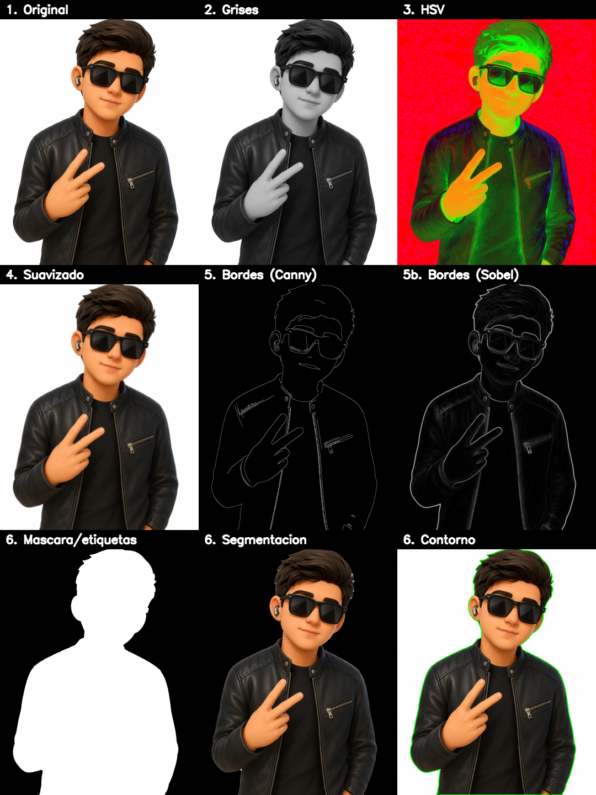

El montaje 3×3 muestra el recorrido completo del pipeline sobre el personaje.
Se aprecia cómo la conversión a grises elimina el color manteniendo la
estructura, el HSV resalta las zonas de color (la piel y los reflejos), el
suavizado homogeneíza las superficies y, sobre todo, cómo la segmentación aísla
el sujeto completo del fondo blanco.

### Etapas individuales — Imagen 1

| Original | Escala de grises | HSV |
|---|---|---|
| 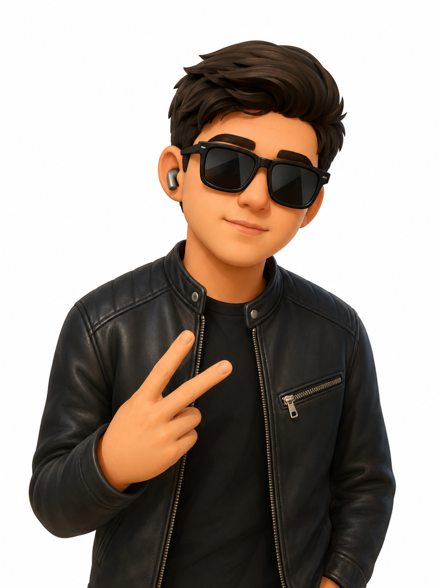 | 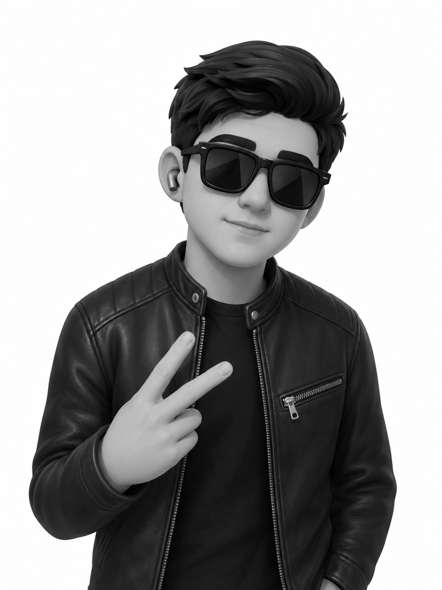 | 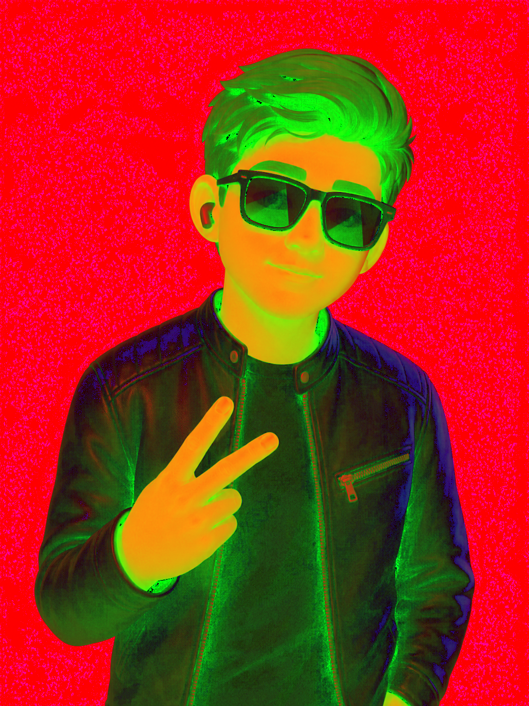 |

| Suavizado Gaussiano | Bordes (Canny) | Bordes (Sobel) |
|---|---|---|
|  | 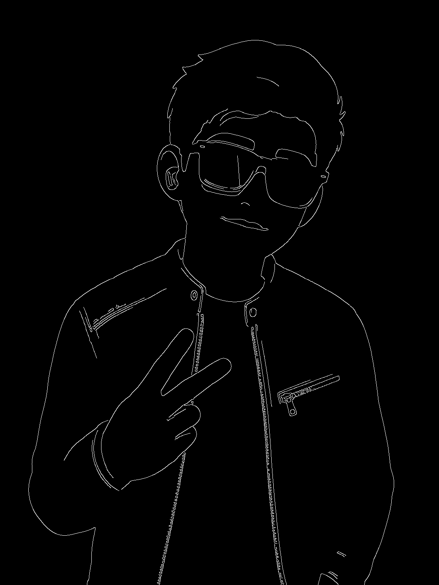 | 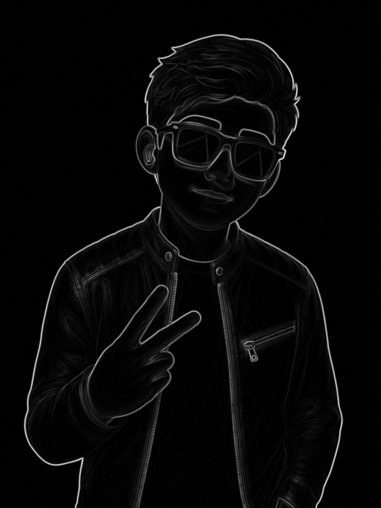 |

La **detección de bordes con Canny** es especialmente nítida: se distinguen con
claridad el contorno del cabello, la montura de las gafas, las costuras y la
cremallera de la chaqueta y los dedos de la mano. Es la evidencia central de que
la etapa de bordes funciona correctamente.

### Segmentación y detección — Imagen 1

| Sujeto segmentado | Contorno sobre original | Rostro detectado (Haar) |
|---|---|---|
| 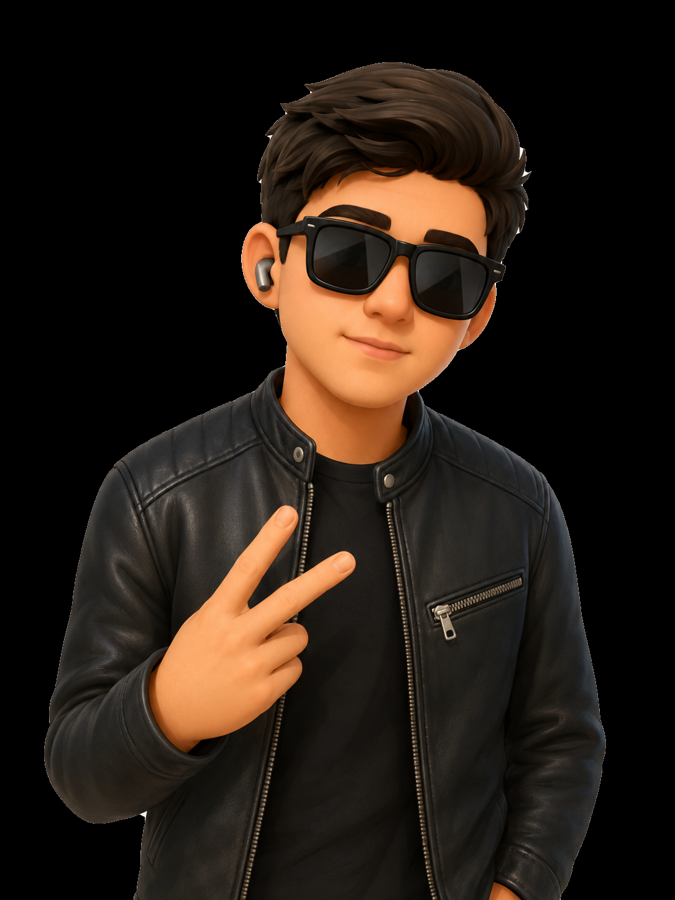 |  |  |

La extracción del sujeto recorta el personaje completo (cabeza, gafas, rostro y
torso) sobre fondo negro; el contorno verde sigue fielmente el borde real. El
Haar Cascade detecta **1 rostro** correctamente, **pese a las gafas de sol** que
ocultan los ojos.

### Montaje comparativo — Imagen 2 (Abbey Road, escena natural)

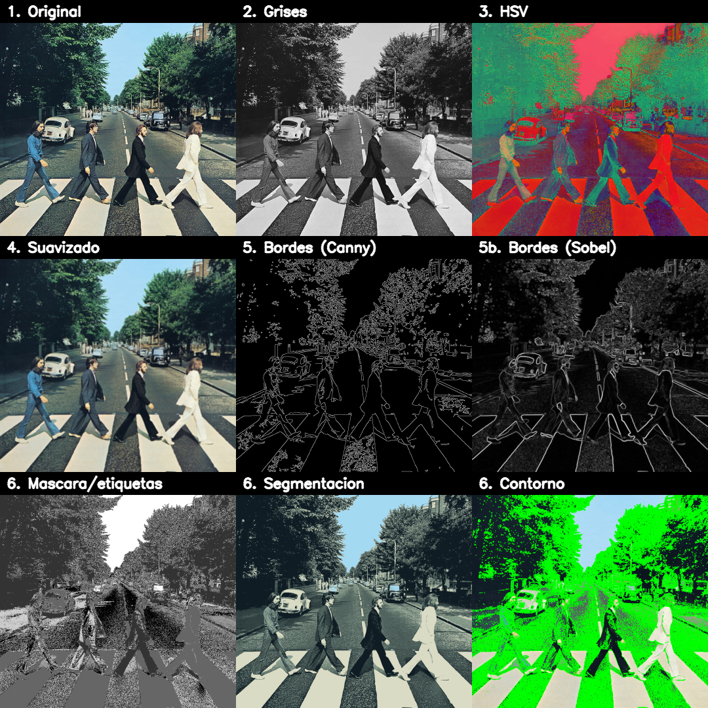

Sobre una escena compleja, la misma secuencia produce resultados distintos pero
igualmente válidos. Los **bordes de Canny** capturan los árboles, las figuras de
los Beatles, el Volkswagen Escarabajo y las franjas del paso de cebra. La
**segmentación cambia automáticamente a K-means**: la imagen recoloreada agrupa
cielo, vegetación, calzada y figuras en regiones de color homogéneas.

### Bordes y segmentación K-means — Imagen 2

| Bordes (Canny) | Segmentación K-means | Fronteras de regiones |
|---|---|---|
| 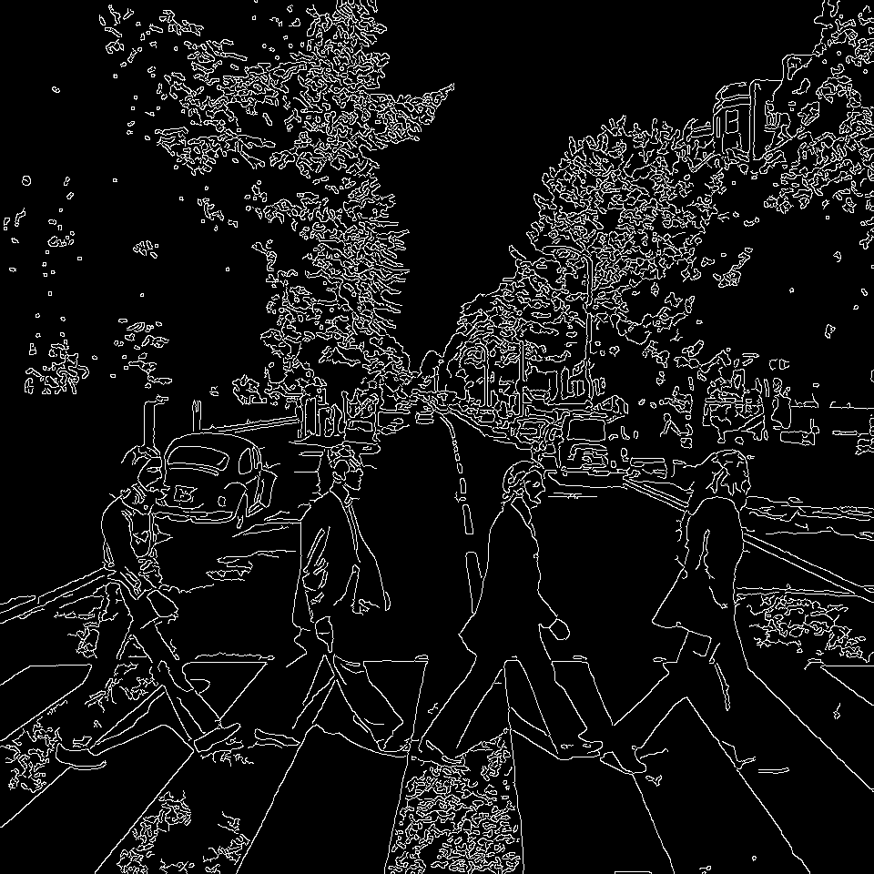 | 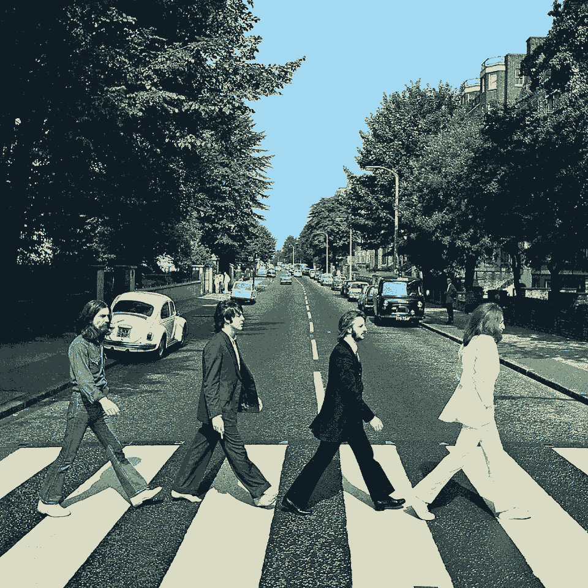 | 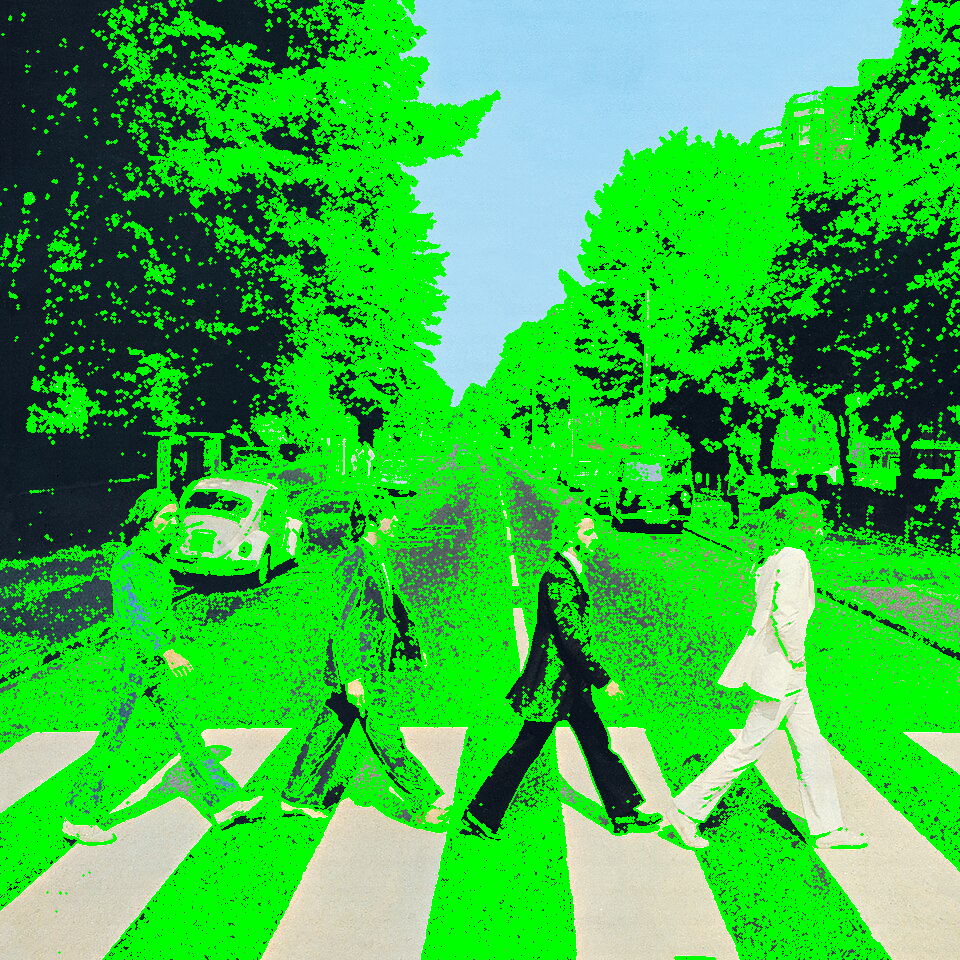 |

En esta imagen la **detección de rostros devuelve 0** de forma intencional y
correcta: los Beatles aparecen lejanos y de perfil/espalda, por lo que no hay un
rostro frontal válido; el tamaño mínimo relativo evita el falso positivo que
antes aparecía sobre el follaje.

---

## Código relevante

### 1. Heurística de fondo y despachador de segmentación

```python
def fondo_uniforme(bgr):
    h, w = bgr.shape[:2]
    margen = max(2, min(h, w) // 25)
    borde = np.concatenate([
        bgr[:margen, :].reshape(-1, 3), bgr[-margen:, :].reshape(-1, 3),
        bgr[:, :margen].reshape(-1, 3), bgr[:, -margen:].reshape(-1, 3)])
    casi_blanco = np.all(borde > FONDO_BLANCO_MIN, axis=1)
    return casi_blanco.mean() > FONDO_FRAC_MIN

def segmentar(bgr, gris):
    if fondo_uniforme(bgr):
        return (*segmentar_sujeto(bgr, gris), "sujeto (umbral + GrabCut)")
    return (*segmentar_kmeans(bgr), f"color K-means (k={KMEANS_K})")
```

Mirar **solo el borde** de la imagen es clave: el sujeto puede ser oscuro o
claro, pero en un fondo de estudio el marco de la imagen es casi siempre el
fondo. Exigir que los tres canales superen 215 distingue blanco real de simple
brillo coloreado, lo que separa correctamente la imagen 1 de la imagen 2.

### 2. Extracción del sujeto: por qué distancia al blanco y no Otsu

```python
dist_blanco = cv2.subtract(255, gris)
_, base = cv2.threshold(dist_blanco, FONDO_THRESH, 255, cv2.THRESH_BINARY)
base = cv2.morphologyEx(base, cv2.MORPH_CLOSE, kernel, iterations=6)
contornos, _ = cv2.findContours(base, cv2.RETR_EXTERNAL, cv2.CHAIN_APPROX_SIMPLE)
relevantes = [c for c in contornos if cv2.contourArea(c) >= area_min]
cv2.drawContours(mascara_base, relevantes, -1, 255, cv2.FILLED)  # todos, no solo el mayor
```

Un Otsu invertido capturaba la chaqueta oscura pero dejaba fuera la piel clara
del rostro (de tono medio, cercano al fondo). La *distancia al blanco* con
umbral fijo conserva todo lo que no sea blanco; el cierre amplio une la cabeza
con el torso y el relleno de **todos** los contornos relevantes evita descartar
la cabeza si quedara como componente separada.

### 3. Detección Haar con tamaño mínimo relativo

```python
lado = int(HAAR_MIN_SIZE_FRAC * min(gris.shape[:2]))   # 8% del lado menor
rostros = cascada.detectMultiScale(
    gris, scaleFactor=1.1, minNeighbors=5, minSize=(lado, lado))
```

Un `minSize` en píxeles absolutos no sirve para imágenes de resoluciones
distintas. Hacerlo **relativo** descarta detecciones diminutas (falsos
positivos en texturas) sin afectar a un rostro grande y real, y funciona igual
en una imagen de 480 px que en una de 1448 px.

---

## Prompts utilizados

```
"La segmentación recorta la cabeza del personaje; corrige la máscara para
incluir el rostro completo (piel clara) sin perder la chaqueta oscura."

"Aplica el mismo proceso a una segunda imagen (foto natural) para tener
resultados de las dos; haz la segmentación adaptativa y evita el falso positivo
de rostro sobre el follaje."
```

---

## Aprendizajes y dificultades

### Aprendizajes

El aprendizaje central fue que **no existe una única técnica de segmentación
universal**: la extracción de sujeto por umbral es óptima para un objeto sobre
fondo uniforme, pero inútil en una escena natural, donde una segmentación por
agrupamiento de color (K-means) sí produce regiones significativas. Diseñar un
despachador que elige la técnica según una medición objetiva del contenido (la
uniformidad del borde) es más robusto que forzar un único método.

También quedó claro el valor del **espacio de color adecuado para cada tarea**:
trabajar el K-means en LAB —perceptualmente uniforme— produce agrupamientos más
coherentes con la percepción humana que hacerlo en BGR, donde las distancias no
corresponden a diferencias percibidas.

### Dificultades

La dificultad técnica principal fue el **recorte de la cabeza** en la primera
versión de la segmentación: Otsu invertido + "solo el contorno mayor" perdía el
rostro. Se resolvió cambiando a distancia al blanco con umbral fijo, cierre
morfológico amplio y relleno de todos los contornos relevantes.

La segunda fue el **falso positivo de Haar** sobre el follaje de la imagen 2,
resuelto con un tamaño mínimo de rostro relativo a la resolución. Además, en la
consola de Windows (cp1252) el carácter `σ` provocaba `UnicodeEncodeError`, que
se corrigió usando el texto `sigma` en los mensajes.

### Mejoras futuras

Sustituir el Haar Cascade por un **detector basado en DNN** (p. ej. el modelo
res10 SSD de OpenCV o un detector tipo YOLO) mejoraría notablemente la detección
en escenas naturales, incluyendo rostros de perfil y a distancia. Para la
segmentación, un modelo de **segmentación semántica** preentrenado (DeepLab,
Mask R-CNN) permitiría etiquetar regiones por clase (persona, vehículo,
vegetación) en lugar de solo por color.

---

## Verificación manual del estudiante

- Se ejecutó el script sobre las **dos imágenes** y se confirmó la generación de
  los resultados en `resultados/` y `resultados/imagen2/` (13 archivos cada una).
- **Imagen 1:** se revisaron visualmente `comparativo.png`,
  `deteccion_o_segmentacion.png` y `segmentacion_contorno.png`; el sujeto
  completo queda segmentado, el contorno sigue el borde real y Haar detecta
  1 rostro.
- **Imagen 2:** se verificó que la segmentación K-means produce regiones de
  color coherentes y que ya no aparece el falso positivo de rostro (0
  detecciones, resultado correcto).

---

## Estructura del proyecto

```
ejercicio_1_procesamiento_visual/
├── src/main.py                         # Pipeline completo (8 operaciones)
├── data/
│   ├── entrada.png                     # Imagen 1 — personaje sobre fondo blanco
│   └── IMAGEN2.jpg                     # Imagen 2 — Abbey Road
├── resultados/                         # Salidas de la imagen 1
│   ├── original.png  grises.png  hsv_o_lab.png  lab.png
│   ├── suavizado.png  suavizado_mediana.png
│   ├── bordes.png  bordes_sobel.png
│   ├── deteccion_o_segmentacion.png  segmentacion_mascara.png
│   ├── segmentacion_contorno.png  deteccion_rostros.png
│   ├── comparativo.png
│   └── imagen2/                        # Mismas salidas para la imagen 2
├── requirements.txt
└── README.md
```

---

## Referencias

- Canny, J. (1986). *A Computational Approach to Edge Detection*. IEEE TPAMI.
- Otsu, N. (1979). *A Threshold Selection Method from Gray-Level Histograms*.
- Rother, C., Kolmogorov, V., & Blake, A. (2004). *GrabCut: Interactive
  Foreground Extraction using Iterated Graph Cuts*. ACM SIGGRAPH.
- Viola, P., & Jones, M. (2001). *Rapid Object Detection using a Boosted Cascade
  of Simple Features*. CVPR. (Base del Haar Cascade)
- MacQueen, J. (1967). *Some Methods for Classification and Analysis of
  Multivariate Observations*. (Algoritmo K-means)
- OpenCV documentation — Image Processing:
  https://docs.opencv.org/4.x/d2/d96/tutorial_py_table_of_contents_imgproc.html
```
